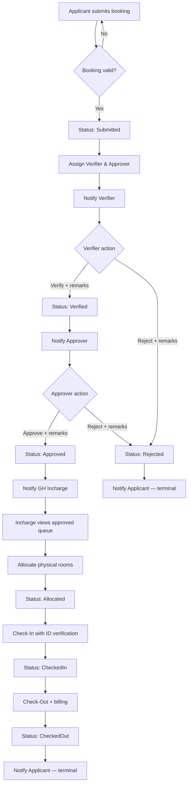
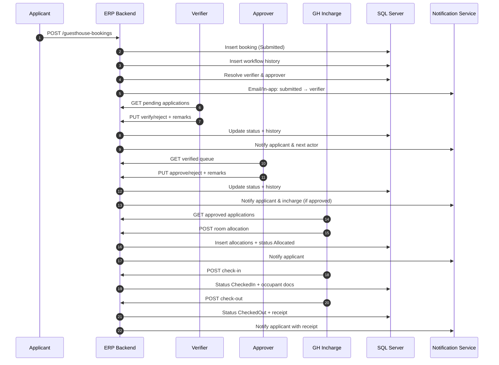
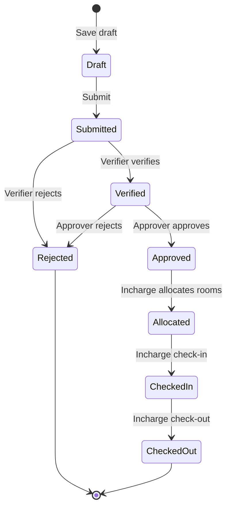
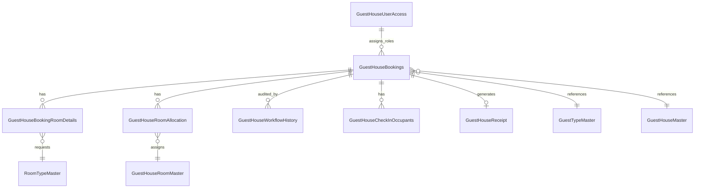
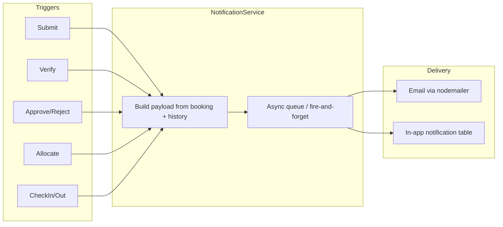

# Guest House Booking — Approval Workflow Architecture

**Document type:** Solution Design  
**Audience:** Development team, DBAs, product owners  
**Author role:** Senior ERP Solution Architect  
**Version:** 1.0  
**Date:** June 23, 2026  

---

## 1. Purpose

This document defines the **end-to-end approval workflow** for Guest House accommodation bookings in the institute ERP. It covers four operational roles, status governance, persistence model, APIs, UI surfaces, audit trail, and notifications.

The design aligns with the existing application direction documented in `frontend/WORKFLOW.md` and extends the schema started in `backend/database/migrations/001_guest_house_allocation.sql`, while resolving inconsistencies found in the current codebase (e.g. `Pending` vs `Submitted`, mixed status spellings).

---

## 2. Workflow Diagram

### 2.1 High-level process flow



### 2.2 Role interaction swimlane



### 2.3 Decision gates (business rules)

| Gate | Rule |
|------|------|
| Verifier queue | Only bookings where `BookingStatus = 'Submitted'` AND `AssignedVerifierID = current user` |
| Approver queue | Only bookings where `BookingStatus = 'Verified'` AND `AssignedApproverID = current user` |
| Allocation | Only bookings where `BookingStatus = 'Approved'` |
| Check-in | Only bookings where `BookingStatus = 'Allocated'` AND arrival date ≤ today |
| Check-out | Only bookings where `BookingStatus = 'CheckedIn'` |
| Rejection | Terminal — no further transitions except admin cancellation/reopen (out of scope v1) |
| Self-approval | Applicant cannot be assigned as verifier or approver for own booking |

---

## 3. Status Transitions

### 3.1 Canonical status values

Use **PascalCase, no spaces** in the database and API. Display labels may add spaces in the UI.

| Status code | Display label | Description |
|-------------|---------------|-------------|
| `Draft` | Draft | Saved locally / server draft; not in workflow |
| `Submitted` | Submitted | Awaiting verifier |
| `Verified` | Verified | Awaiting approver |
| `Approved` | Approved | Awaiting room allocation |
| `Rejected` | Rejected | Terminal — rejected by verifier or approver |
| `Allocated` | Allocated | Rooms assigned; awaiting check-in |
| `CheckedIn` | Checked In | Guest physically checked in |
| `CheckedOut` | Checked Out | Stay completed; terminal |
| `Cancelled` | Cancelled | Cancelled by applicant/admin before check-in (optional v1.1) |

> **Note:** Replace legacy values `Pending`, `Checked-In`, `Checked In` with the canonical codes above across frontend and backend.

### 3.2 State machine



### 3.3 Transition matrix

| From status | Action | Actor | To status | Required fields |
|-------------|--------|-------|-----------|-----------------|
| `Draft` | Submit | Applicant | `Submitted` | Full booking payload |
| `Submitted` | Verify | Verifier | `Verified` | Remarks (optional) |
| `Submitted` | Reject | Verifier | `Rejected` | Remarks (mandatory) |
| `Verified` | Approve | Approver | `Approved` | Remarks (optional) |
| `Verified` | Reject | Approver | `Rejected` | Remarks (mandatory) |
| `Approved` | Allocate | GH Incharge | `Allocated` | Room IDs, charges (optional) |
| `Allocated` | CheckIn | GH Incharge | `CheckedIn` | ID proof, occupant details |
| `CheckedIn` | CheckOut | GH Incharge | `CheckedOut` | Final charges, remarks |
| `Approved` | Cancel | Applicant/Admin | `Cancelled` | Reason (optional v1.1) |

### 3.4 Workflow action codes (for audit)

Separate **status** (booking state) from **action** (what someone did):

| Action code | Description |
|-------------|-------------|
| `SUBMIT` | Applicant submitted application |
| `VERIFY` | Verifier verified |
| `VERIFY_REJECT` | Verifier rejected |
| `APPROVE` | Approver approved |
| `APPROVE_REJECT` | Approver rejected |
| `ALLOCATE` | Rooms allocated |
| `REALLOCATE` | Allocation changed (same status) |
| `CHECKIN` | Guest checked in |
| `CHECKOUT` | Guest checked out |
| `CANCEL` | Booking cancelled |
| `NOTIFY` | System notification dispatched (optional log) |

---

## 4. Database Design

### 4.1 Entity relationship overview



### 4.2 Core booking table — `GuestHouseBookings`

Extends existing table. New columns support workflow routing and timestamps.

```sql
-- Existing columns (from application + migration 001)
-- BookingID, GuestTypeID, GuestName, GuestDesignation, GuestAddress,
-- PurposeOfVisit, GuestHouseID, RoomTypeID, NoofRoomsReq, TotalRoomsReq,
-- OccupantsNo, GuestContactNo, GuestEmailID, GuestNationality,
-- ArrivalDateTime, DepartureDateTime, SpecialRequirements,
-- ExpenditureHead, ProjectNumber, MealsRequired,
-- BookedBy, BookingDateTime, BookingStatus

-- Workflow & assignment columns (NEW)
ALTER TABLE GuestHouseBookings ADD
    AssignedVerifierID   NVARCHAR(20)  NULL,
    AssignedApproverID   NVARCHAR(20)  NULL,
    AssignedInchargeID   NVARCHAR(20)  NULL,
    VerifierRemarks      NVARCHAR(1000) NULL,
    ApproverRemarks      NVARCHAR(1000) NULL,
    VerifiedBy           NVARCHAR(20)  NULL,
    VerifiedDateTime     DATETIME2     NULL,
    ApprovedBy           NVARCHAR(20)  NULL,
    ApprovedDateTime     DATETIME2     NULL,
    RejectedBy           NVARCHAR(20)  NULL,
    RejectedDateTime     DATETIME2     NULL,
    RejectionStage       NVARCHAR(20)  NULL,  -- 'Verifier' | 'Approver'
    AllocatedBy          NVARCHAR(20)  NULL,
    AllocatedDateTime    DATETIME2     NULL,
    CheckedInBy          NVARCHAR(20)  NULL,
    CheckedInDateTime    DATETIME2     NULL,
    CheckedOutBy         NVARCHAR(20)  NULL,
    CheckedOutDateTime   DATETIME2     NULL,
    CurrentStage         NVARCHAR(30)  NULL,  -- denormalized: 'WithVerifier', 'WithApprover', etc.
    IsActive             BIT           NOT NULL CONSTRAINT DF_GHB_IsActive DEFAULT 1;

-- Status constraint
ALTER TABLE GuestHouseBookings ADD CONSTRAINT CK_GHB_BookingStatus CHECK (
    BookingStatus IN (
        'Draft','Submitted','Verified','Approved','Rejected',
        'Allocated','CheckedIn','CheckedOut','Cancelled'
    )
);

CREATE INDEX IX_GHB_Status_Verifier
    ON GuestHouseBookings(BookingStatus, AssignedVerifierID)
    WHERE BookingStatus = 'Submitted';

CREATE INDEX IX_GHB_Status_Approver
    ON GuestHouseBookings(BookingStatus, AssignedApproverID)
    WHERE BookingStatus = 'Verified';

CREATE INDEX IX_GHB_Status_Incharge
    ON GuestHouseBookings(BookingStatus, GuestHouseID)
    WHERE BookingStatus IN ('Approved','Allocated','CheckedIn');
```

### 4.3 Room requirements — `GuestHouseBookingRoomDetails`

Already defined in migration `001`. One row per room type requested.

| Column | Type | Notes |
|--------|------|-------|
| GHBookingRoomID | INT PK | Identity |
| GHBookingID | INT FK | → GuestHouseBookings |
| RoomTypeID | INT FK | → RoomTypeMaster |
| NoOfRooms | INT | CHECK > 0 |
| UQ | (GHBookingID, RoomTypeID) | Prevent duplicate room types |

### 4.4 Physical allocation — `GuestHouseRoomAllocation`

Already defined in migration `001`. Extend for billing metadata.

```sql
ALTER TABLE GuestHouseRoomAllocation ADD
    RatePerDay        DECIMAL(10,2) NULL,
    AdditionalAmount  DECIMAL(10,2) NULL CONSTRAINT DF_GHRA_AddAmt DEFAULT 0,
    DiscountAmount    DECIMAL(10,2) NULL CONSTRAINT DF_GHRA_DiscAmt DEFAULT 0,
    AllocationRemarks NVARCHAR(500)  NULL;
```

### 4.5 Audit trail — `GuestHouseWorkflowHistory`

As specified in `frontend/WORKFLOW.md`. Append-only.

```sql
CREATE TABLE GuestHouseWorkflowHistory (
    WorkflowHistoryID  INT IDENTITY(1,1) PRIMARY KEY,
    GHBookingID        INT           NOT NULL,
    ActionCode         NVARCHAR(30)  NOT NULL,
    FromStatus         NVARCHAR(20)  NULL,
    ToStatus           NVARCHAR(20)  NOT NULL,
    ActionByEmployeeID NVARCHAR(20)  NOT NULL,
    ActionByName       NVARCHAR(150) NULL,
    ActionDateTime     DATETIME2     NOT NULL CONSTRAINT DF_GHWH_Date DEFAULT SYSDATETIME(),
    Remarks            NVARCHAR(1000) NULL,
    ForwardedToEmployeeID NVARCHAR(20) NULL,
    ForwardedToRole    NVARCHAR(30)  NULL,
    IPAddress          NVARCHAR(45)  NULL,
    UserAgent          NVARCHAR(500) NULL,
    MetadataJSON       NVARCHAR(MAX) NULL,
    CONSTRAINT FK_GHWH_Booking FOREIGN KEY (GHBookingID)
        REFERENCES GuestHouseBookings(BookingID)
);

CREATE INDEX IX_GHWH_Booking ON GuestHouseWorkflowHistory(GHBookingID, ActionDateTime DESC);
CREATE INDEX IX_GHWH_Actor  ON GuestHouseWorkflowHistory(ActionByEmployeeID, ActionDateTime DESC);
```

**MetadataJSON examples:**

- Allocation: `{ "roomIds": [1,2], "totalAmount": 11000 }`
- Check-in: `{ "primaryIdProofType": "Aadhaar", "occupantCount": 2 }`

### 4.6 Role access — `GuestHouseUserAccess`

Referenced by existing `workflowService.js`.

| Column | Type | Notes |
|--------|------|-------|
| AccessID | INT PK | |
| EmployeeID | NVARCHAR(20) | Institute employee ID |
| EmployeeName | NVARCHAR(150) | |
| OfficialEmailID | NVARCHAR(255) | For notifications |
| RoleName | NVARCHAR(30) | `Verifier`, `Approver`, `GHIncharge` |
| GuestHouseID | INT NULL | Scope incharge to a property |
| DepartmentID | NVARCHAR(20) NULL | Optional routing by dept |
| IsActive | BIT | |
| EffectiveFrom | DATE | |
| EffectiveTo | DATE NULL | |

### 4.7 Check-in occupants — `GuestHouseCheckInOccupants`

```sql
CREATE TABLE GuestHouseCheckInOccupants (
    OccupantID       INT IDENTITY(1,1) PRIMARY KEY,
    GHBookingID      INT NOT NULL,
    OccupantName     NVARCHAR(150) NOT NULL,
    Relationship     NVARCHAR(50)  NULL,
    Age              INT           NULL,
    IdProofType      NVARCHAR(50)  NULL,
    IdProofNumber    NVARCHAR(100) NULL,
    DocumentPath     NVARCHAR(500) NULL,
    IsPrimaryGuest   BIT NOT NULL CONSTRAINT DF_GHCO_Primary DEFAULT 0,
    CreatedBy        NVARCHAR(20)  NOT NULL,
    CreatedDateTime  DATETIME2     NOT NULL CONSTRAINT DF_GHCO_Date DEFAULT SYSDATETIME(),
    CONSTRAINT FK_GHCO_Booking FOREIGN KEY (GHBookingID)
        REFERENCES GuestHouseBookings(BookingID)
);
```

### 4.8 Receipt — `GuestHouseReceipt`

```sql
CREATE TABLE GuestHouseReceipt (
    ReceiptID           INT IDENTITY(1,1) PRIMARY KEY,
    GHBookingID         INT NOT NULL UNIQUE,
    ReceiptNo           NVARCHAR(30) NOT NULL UNIQUE,
    AccommodationAmount DECIMAL(12,2) NOT NULL,
    MealCharges         DECIMAL(12,2) NOT NULL CONSTRAINT DF_GHR_Meals DEFAULT 0,
    AdditionalAmount    DECIMAL(12,2) NOT NULL CONSTRAINT DF_GHR_Add DEFAULT 0,
    DiscountAmount      DECIMAL(12,2) NOT NULL CONSTRAINT DF_GHR_Disc DEFAULT 0,
    TotalPayableAmount  DECIMAL(12,2) NOT NULL,
    PaymentStatus       NVARCHAR(20) NOT NULL CONSTRAINT DF_GHR_PayStat DEFAULT 'Pending',
    GeneratedBy         NVARCHAR(20)  NOT NULL,
    GeneratedDateTime   DATETIME2     NOT NULL CONSTRAINT DF_GHR_Date DEFAULT SYSDATETIME(),
    CONSTRAINT FK_GHR_Booking FOREIGN KEY (GHBookingID)
        REFERENCES GuestHouseBookings(BookingID)
);
```

### 4.9 Master data (reference)

| Table | Purpose |
|-------|---------|
| `GuestTypeMaster` | Official guest categories |
| `RoomTypeMaster` | Single, Double, Suite, etc. |
| `GuestHouseMaster` / `CONTRACTSERVICES..GuestHouseMaster` | Physical guest house properties |
| `GuestHouseRoomMaster` | Individual room inventory |
| `GuestHouseTariffMaster` | Rate slabs by guest house + room type + duration |
| `GuestHouseTypeRoomTypeMapping` | Valid room types per guest house |

### 4.10 Assignment algorithm

On submit (`Submitted`):

```
1. Load active users from GuestHouseUserAccess
2. Verifier  = first Verifier where EmployeeID ≠ BookedBy
              (optionally match applicant department)
3. Approver  = first Approver where EmployeeID ≠ BookedBy AND ≠ Verifier
4. Incharge  = GHIncharge where GuestHouseID = booking.GuestHouseID
5. Persist AssignedVerifierID, AssignedApproverID, AssignedInchargeID
6. Set CurrentStage = 'WithVerifier'
7. Insert GuestHouseWorkflowHistory (SUBMIT)
```

Uses existing `assignmentService.js` pattern, upgraded to async DB lookup.

---

## 5. Required APIs

Base path: `/api`. All endpoints require authenticated employee context (CIMS SSO header/session). Responses use `{ success, data, message }` envelope.

### 5.1 Applicant APIs

| Method | Endpoint | Purpose |
|--------|----------|---------|
| GET | `/user/current-user` | Employee profile + roles |
| GET | `/master/guesthouse-types` | Guest house dropdown |
| GET | `/master/room-types/:guestHouseId` | Room types for selected GH |
| GET | `/master/tariff-details` | Tariff reference |
| GET | `/guest-types` | Guest type master |
| GET | `/expenditure-heads` | Expenditure head options |
| POST | `/guesthouse-bookings` | Submit new booking |
| GET | `/guesthouse-bookings/my` | List applicant's bookings |
| GET | `/guesthouse-bookings/:bookingId` | Booking detail + timeline |
| GET | `/guesthouse-bookings/:bookingId/history` | Workflow audit trail |
| POST | `/guesthouse-bookings/draft` | Save draft (optional) |
| PUT | `/guesthouse-bookings/:bookingId/cancel` | Cancel before allocation (optional) |

**POST `/guesthouse-bookings` — request body**

```json
{
  "GuestTypeID": 1,
  "GuestName": "Dr. Rajesh Kumar",
  "GuestDesignation": "Professor",
  "GuestAddress": "IIT Mandi",
  "PurposeOfVisit": "Official visit",
  "GuestHouseID": 1,
  "OccupantsNo": 2,
  "GuestContactNo": "+919876543210",
  "GuestEmailID": "guest@example.com",
  "GuestNationality": "Indian",
  "ArrivalDateTime": "2026-07-01T10:00:00",
  "DepartureDateTime": "2026-07-05T10:00:00",
  "SpecialRequirements": "Ground floor preferred",
  "ExpenditureHead": "Institute Fund",
  "ProjectNumber": null,
  "MealsRequired": true,
  "RoomRequirements": [
    { "RoomTypeID": 1, "NoOfRooms": 1 },
    { "RoomTypeID": 2, "NoOfRooms": 1 }
  ],
  "SupportingDocumentIds": []
}
```

**Response — 201**

```json
{
  "success": true,
  "data": {
    "BookingID": 101,
    "BookingStatus": "Submitted",
    "AssignedVerifierID": "EMP001",
    "AssignedApproverID": "EMP002"
  },
  "message": "Application submitted successfully"
}
```

### 5.2 Verifier APIs

| Method | Endpoint | Purpose |
|--------|----------|---------|
| GET | `/verifier/dashboard-counts` | KPI cards |
| GET | `/verifier/pending-applications` | Queue (`Submitted`, assigned to me) |
| GET | `/verifier/applications/:bookingId` | Full application for review |
| PUT | `/verifier/applications/:bookingId/status` | Verify or reject |

**PUT body**

```json
{
  "decision": "Verified",
  "remarks": "Documents and purpose verified."
}
```

`decision` allowed values: `Verified` | `Rejected`  
`remarks` mandatory when `decision = Rejected`

**Server behaviour**

- Validate actor = `AssignedVerifierID`
- Validate current status = `Submitted`
- Update booking + insert history
- Trigger notification to approver (verify) or applicant (reject)

### 5.3 Approver APIs

| Method | Endpoint | Purpose |
|--------|----------|---------|
| GET | `/approver/dashboard-counts` | KPI cards |
| GET | `/approver/pending-applications` | Queue (`Verified`, assigned to me) |
| GET | `/approver/applications/:bookingId` | Full application |
| PUT | `/approver/applications/:bookingId/status` | Approve or reject |

**PUT body**

```json
{
  "decision": "Approved",
  "remarks": "Approved for conference visit."
}
```

`decision` allowed values: `Approved` | `Rejected`

### 5.4 Guest House Incharge APIs

| Method | Endpoint | Purpose |
|--------|----------|---------|
| GET | `/guesthouse-incharge/dashboard-counts` | KPI cards |
| GET | `/guesthouse-incharge/applications` | All apps for scoped GH |
| GET | `/guesthouse-incharge/applications?actionRequired=true` | Approved only (allocation queue) |
| GET | `/guesthouse-incharge/applications/:bookingId` | Detail + room requirements + existing allocations |
| GET | `/guesthouse-incharge/applications/:bookingId/available-rooms` | Rooms free for date range |
| POST | `/guesthouse-incharge/applications/:bookingId/allocations` | Assign rooms |
| PUT | `/guesthouse-incharge/applications/:bookingId/allocations` | Re-allocate (optional) |
| POST | `/guesthouse-incharge/applications/:bookingId/check-in` | Complete check-in |
| POST | `/guesthouse-incharge/applications/:bookingId/check-out` | Complete check-out + receipt |
| GET | `/guesthouse-incharge/check-ins/today` | Today's arrivals |
| GET | `/guesthouse-incharge/check-outs/today` | Today's departures |
| GET | `/guesthouse-incharge/receipt/:bookingId` | Receipt detail |
| GET | `/guesthouse-incharge/calendar/availability` | Room calendar view |

**POST allocations body**

```json
{
  "roomIds": [101, 205],
  "mealsRequired": true,
  "mealCharges": 1500,
  "additionalAmount": 500,
  "discountAmount": 1000,
  "remarks": "Corner room as requested"
}
```

**POST check-in body**

```json
{
  "primaryGuest": {
    "idProofType": "Aadhaar",
    "idProofNumber": "XXXX-XXXX-1234",
    "documentId": "file-upload-ref-001"
  },
  "occupants": [
    {
      "name": "Spouse Name",
      "relationship": "Spouse",
      "age": 35,
      "idProofType": "Passport",
      "idProofNumber": "P1234567",
      "documentId": "file-upload-ref-002"
    }
  ],
  "checkInRemarks": "Arrived at 14:30"
}
```

**POST check-out body**

```json
{
  "mealCharges": 1500,
  "additionalAmount": 200,
  "discountAmount": 0,
  "paymentStatus": "Pending",
  "checkOutRemarks": "Early departure by 1 hour"
}
```

### 5.5 Shared / utility APIs

| Method | Endpoint | Purpose |
|--------|----------|---------|
| GET | `/master/application/:bookingId` | Read-only view (print/PDF) |
| POST | `/files/upload` | Supporting docs, ID proofs |
| GET | `/notifications/my` | In-app notification inbox |
| PUT | `/notifications/:id/read` | Mark read |

### 5.6 API authorization matrix

| Endpoint group | Applicant | Verifier | Approver | GH Incharge |
|----------------|-----------|----------|----------|-------------|
| Submit / my bookings | ✓ | — | — | — |
| Verifier actions | — | ✓ (assigned) | — | — |
| Approver actions | — | — | ✓ (assigned) | — |
| Incharge ops | — | — | — | ✓ (scoped GH) |
| View own booking history | ✓ | ✓ (assigned) | ✓ (assigned) | ✓ (scoped) |

### 5.7 Error codes

| HTTP | Code | When |
|------|------|------|
| 400 | `INVALID_TRANSITION` | Status/action combination not allowed |
| 403 | `NOT_ASSIGNED` | User not assigned to this booking |
| 404 | `BOOKING_NOT_FOUND` | Invalid BookingID |
| 409 | `ROOM_UNAVAILABLE` | Room overlap on allocation |
| 422 | `REMARKS_REQUIRED` | Rejection without remarks |

---

## 6. Required React Pages

Map to existing pages where possible. **Bold** = exists; *italic* = needs build/completion.

### 6.1 Applicant module

| Route | Page | Purpose |
|-------|------|---------|
| `/` | **MainDashboard** | Module selector |
| `/guesthouse-dashboard` | **GuestHouseDashboard** | GH module hub |
| `/guesthouse` | **GuestHouseForm** | Create / submit booking |
| `/guesthouse-preview` | **GuestHousePreview** | Review before submit |
| `/my-guesthouse-bookings` | **MyGuestHouseBookings** | List own applications |
| `/tracking/:id` | *RequestTracking* | Live workflow timeline (wire to history API) |
| `/guesthouse/print/:id` | **GuestHousePrintPage** | Printable application |

### 6.2 Verifier module

| Route | Page | Purpose |
|-------|------|---------|
| `/verifier` | **VerifierDashboard** | KPI + pending queue |
| `/verifier/application/:bookingId` | **VerifierApplicationPage** | Detail + action panel |
| `/verify/:id` | **VerifierAction** | Standalone action (can merge into application page) |

**VerifierDashboard layout**

```
┌─────────────────────────────────────────────┐
│ KPI Cards: Total | Pending | Verified | Rejected │
├─────────────────────────────────────────────┤
│ Pending applications table                   │
├──────────────────┬──────────────────────────┤
│ ApplicationView  │ TakeAction (Verify/Reject)│
└──────────────────┴──────────────────────────┘
```

### 6.3 Approver module

| Route | Page | Purpose |
|-------|------|---------|
| `/approver` | **ApproverDashboard** | KPI + verified queue |
| `/approver/request/:id` | **ApproverRequestDetails** | Detail view |
| `/approver/application/:bookingId` | **ApproverApplicationPage** | Detail + approve/reject |

### 6.4 Guest House Incharge module

| Route | Page | Purpose |
|-------|------|---------|
| `/gh-incharge` | **GHInchargeDashboard** | All apps + action-required tab |
| `/guesthouse-incharge/allocation/:bookingId` | **GHAllocationPage** | ApplicationView + RoomAllocationPanel |
| `/gh-incharge/checkins` | **GHCheckInDashboard** | Today's arrivals |
| `/gh-incharge/checkin/:bookingId` | **GHCheckInPage** | ID verification + occupants |
| `/gh-incharge/checkouts` | *GHCheckOutDashboard* | Today's departures (empty file today) |
| `/gh-incharge/checkout/:bookingId` | *GHCheckOutPage* | Final charges + confirm |
| `/guesthouse-incharge/receipt/:bookingId` | **ReceiptPage** | Receipt display / print |
| `/gh-incharge/calendar` | *RoomAvailabilityCalendar* | Room occupancy calendar (not routed yet) |

### 6.5 Cross-cutting UI components

| Component | Used on |
|-----------|---------|
| **ApplicationView** | Verifier, Approver, Incharge, Print |
| **DashboardPage / DashboardCards / DashboardTable** | Verifier, Approver |
| **RoomAllocationPanel** | GHAllocationPage |
| **TakeAction** (VerifierAction / ApproverAction) | Decision + remarks |
| *WorkflowTimeline* (new) | RequestTracking, all detail pages |
| **UserSwitcher** → *AuthLayout* | Dev only → replace with CIMS SSO |

### 6.6 Page → API mapping summary

| Page | Primary APIs |
|------|--------------|
| GuestHouseForm | POST `/guesthouse-bookings`, master GETs |
| MyGuestHouseBookings | GET `/guesthouse-bookings/my` |
| RequestTracking | GET `/guesthouse-bookings/:id/history` |
| VerifierDashboard | GET `/verifier/pending-applications`, `/dashboard-counts` |
| VerifierAction | PUT `/verifier/applications/:id/status` |
| ApproverDashboard | GET `/approver/pending-applications`, `/dashboard-counts` |
| ApproverAction | PUT `/approver/applications/:id/status` |
| GHInchargeDashboard | GET `/guesthouse-incharge/applications` |
| GHAllocationPage | GET application, available-rooms; POST allocations |
| GHCheckInPage | POST check-in |
| GHCheckOutPage | POST check-out |
| ReceiptPage | GET receipt |

---

## 7. Audit Trail Design

### 7.1 Principles

1. **Append-only** — history rows are never updated or deleted.
2. **Every state change** produces one history row minimum.
3. **Actor attribution** — employee ID, name, timestamp, optional IP.
4. **Forward traceability** — record who receives the booking next.
5. **Queryable** — applicants see their timeline; admins see full log.

### 7.2 What gets logged

| Event | ActionCode | FromStatus | ToStatus | ForwardedTo |
|-------|------------|------------|----------|-------------|
| Submit | SUBMIT | Draft/NULL | Submitted | AssignedVerifierID / Verifier |
| Verify | VERIFY | Submitted | Verified | AssignedApproverID / Approver |
| Verifier reject | VERIFY_REJECT | Submitted | Rejected | NULL |
| Approve | APPROVE | Verified | Approved | AssignedInchargeID / GHIncharge |
| Approver reject | APPROVE_REJECT | Verified | Rejected | NULL |
| Allocate | ALLOCATE | Approved | Allocated | NULL |
| Check-in | CHECKIN | Allocated | CheckedIn | NULL |
| Check-out | CHECKOUT | CheckedIn | CheckedOut | NULL |

### 7.3 Server-side audit service

```
WorkflowAuditService.logTransition({
  bookingId,
  actionCode,
  fromStatus,
  toStatus,
  actionBy,          // from auth context
  remarks,
  forwardedTo,       // { employeeId, role }
  metadata           // JSON: room ids, amounts, etc.
})
```

Called inside a **database transaction** together with the booking status update.

### 7.4 Applicant-facing timeline UI

Render `GuestHouseWorkflowHistory` ordered by `ActionDateTime ASC`:

```
✓ Submitted          — 20 Jun 2026, 09:00 — You
✓ Verified           — 21 Jun 2026, 11:30 — Verifier Name — "Documents OK"
✓ Approved           — 22 Jun 2026, 15:00 — Approver Name
✓ Rooms Allocated    — 23 Jun 2026, 10:00 — GH Incharge — GH101, GH201
○ Check-In           — Pending
○ Check-Out          — Pending
```

Rejected bookings show the rejection stage, actor, and mandatory remarks.

### 7.5 Compliance & retention

| Requirement | Implementation |
|-------------|----------------|
| Non-repudiation | Store EmployeeID from SSO, not client-supplied |
| Retention | Keep history minimum 7 years (institute policy) |
| PII in remarks | Sanitize; do not store raw ID numbers in remarks field |
| Admin export | GET `/admin/bookings/:id/audit-export` (CSV/PDF) — future |

---

## 8. Notification Flow

### 8.1 Channels

| Channel | v1 | v1.1 |
|---------|----|----|
| Email (OfficialMailID) | ✓ | ✓ |
| In-app notification | ✓ | ✓ |
| SMS | — | Optional |

Use existing `emailService.js` + templates under `backend/templates/emails/`.

### 8.2 Notification matrix

| Trigger | Recipients | Template | Priority |
|---------|------------|----------|----------|
| Booking submitted | Applicant | `applicationSubmitted` | Info |
| Booking submitted | Assigned Verifier | `verifierAssigned` (new) | Action |
| Verified | Applicant | `applicationVerified` | Info |
| Verified | Assigned Approver | `approverAssigned` (new) | Action |
| Approved | Applicant | `applicationApproved` | Info |
| Approved | Assigned GH Incharge | `inchargeAssigned` (new) | Action |
| Rejected (verifier) | Applicant | `applicationRejected` | High |
| Rejected (approver) | Applicant | `applicationRejected` | High |
| Rooms allocated | Applicant | `roomAllocated` | Info |
| Checked in | Applicant | `guestCheckedIn` (new) | Info |
| Checked out + receipt | Applicant | `guestCheckedOut` (new) | Info |

### 8.3 Notification flow diagram



### 8.4 In-app notifications table

```sql
CREATE TABLE GuestHouseNotifications (
    NotificationID   INT IDENTITY(1,1) PRIMARY KEY,
    GHBookingID      INT NULL,
    RecipientEmployeeID NVARCHAR(20) NOT NULL,
    NotificationType NVARCHAR(30) NOT NULL,
    Title            NVARCHAR(200) NOT NULL,
    Body             NVARCHAR(1000) NOT NULL,
    ActionUrl        NVARCHAR(500) NULL,
    IsRead           BIT NOT NULL CONSTRAINT DF_GHN_Read DEFAULT 0,
    CreatedDateTime  DATETIME2 NOT NULL CONSTRAINT DF_GHN_Date DEFAULT SYSDATETIME(),
    ReadDateTime     DATETIME2 NULL
);
```

### 8.5 Email template variables

Common merge fields for all templates:

| Variable | Source |
|----------|--------|
| `EmployeeName` | Recipient employee master |
| `BookingNo` | `GH` + zero-padded BookingID |
| `GuestName` | Booking |
| `ArrivalDate` / `DepartureDate` | Booking |
| `GuestHouseName` | GuestHouseMaster |
| `CurrentStatus` | BookingStatus |
| `ActionUrl` | Deep link to role dashboard |
| `Remarks` | From workflow action |
| `RejectedByRole` | Verifier / Approver |

### 8.6 Failure handling

- Email failures must **not roll back** the workflow transaction.
- Log failed sends to `GuestHouseNotificationLog` with retry count.
- Retry policy: 3 attempts with exponential backoff.
- Verifier/approver action succeeds even if email is delayed.

---

## 9. Implementation Phases (Recommended)

| Phase | Scope | Outcome |
|-------|-------|---------|
| **Phase 1** | DB migration + submit + verify + approve APIs with real SQL | Core approval chain live |
| **Phase 2** | Allocation + audit history + notifications | Incharge can allocate; full trace |
| **Phase 3** | Check-in / check-out + receipt + file upload | Operational completion |
| **Phase 4** | CIMS SSO + route guards + in-app notifications | Production readiness |
| **Phase 5** | Calendar, cancellation, SLA reminders | Operational excellence |

---

## 10. Alignment with Current Codebase

| Area | Current state | Target per this document |
|------|---------------|--------------------------|
| Initial status | Mixed `Pending` / `Submitted` | **`Submitted`** |
| Check-in/out status | `Checked In`, `Checked-In` | **`CheckedIn`**, **`CheckedOut`** |
| Approver API path | `/api/approver/:id` (wrong) | **`/api/approver/applications/:id/status`** |
| Audit table | Documented only | **`GuestHouseWorkflowHistory`** implemented |
| Check-out pages | Empty files | **Build per Section 6.4** |
| Backend data | Mock arrays | **SQL Server persistence** |
| User identity | Hardcoded EMP IDs | **CIMS SSO + GuestHouseUserAccess** |

---

## 11. Glossary

| Term | Definition |
|------|------------|
| Booking / Application | Single guest house accommodation request |
| Allocation | Assignment of specific physical rooms to an approved booking |
| Verifier | First-level reviewer (typically dept/admin verification) |
| Approver | Second-level authority approving institute liability |
| GH Incharge | On-site operator managing rooms, check-in/out, billing |
| CIMS | Campus Identity Management System (future SSO source) |

---

*This is a solution design document. No application source code was modified during its creation.*
